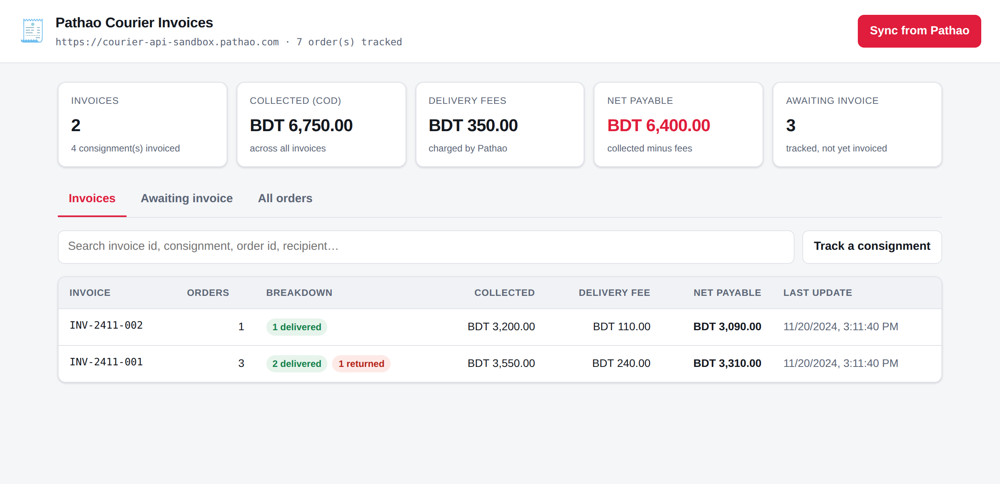

# Pathao Courier — Invoice Dashboard

An app that shows all of your Pathao Courier invoices, built on the Pathao
Courier Merchant API. It wraps every documented merchant endpoint in a typed
TypeScript client, tracks your consignments in SQLite, and groups them into
invoices in a web dashboard.



---

## How invoices work here (read this first)

**The Pathao Merchant API has no invoice endpoint.** There is no
"list my invoices" call. Orders *can* be listed — `GET /aladdin/api/v1/orders/all`
returns the merchant's own history, paginated 40 to a page, and it is the
fastest way to fill this app (see `POST /api/orders/import-all`). It is absent
from the merchant integration docs, so treat it as undocumented rather than
guaranteed. Per consignment, an invoice appears as the `invoice_id` field on
its short info:

```
GET /aladdin/api/v1/orders/{consignment_id}/info
→ { ..., "order_status": "Delivered", "invoice_id": "INV-2411-001" }
```

`invoice_id` is `null` until Pathao bills that consignment.

So invoices are **derived**, not fetched:

1. Orders are recorded locally — created through this app, imported by
   consignment id, or pulled wholesale with **Import all from Pathao**. An
   order not tracked here can never appear on an invoice.
2. **Sync** re-reads each tracked consignment's short info and stores the
   `invoice_id`, status and update time it returns.
3. Orders sharing an `invoice_id` are grouped into one invoice, with totals
   summed across its consignments.

Two consequences worth knowing:

- **Orders created elsewhere** (Pathao's own dashboard, bulk upload, a previous
  system) are invisible until you add them with their consignment id — see
  [Tracking existing consignments](#tracking-existing-consignments).
- **Short info returns no money fields.** `amount_to_collect` and
  `delivery_fee` are known only for orders this app created. When importing an
  existing consignment, pass the amounts alongside the id or it lands on its
  invoice valued at zero.

---

## Return rate

The dashboard reports a return rate in two places: one tile across everything
tracked, and a column plus a drawer figure per invoice.

```
return rate = returned ÷ (delivered + returned)
```

The denominator is deliberately narrow — only **forward consignments that
reached a final outcome** count:

| Excluded | Why |
| --- | --- |
| Return and exchange legs (`order_type` = Return/Exchange) | Pathao books the trip back as its own consignment sharing the invoice. Counting it would tally the same parcel twice. |
| In transit, at hub, on the way | No verdict yet. |
| Pickup failed / cancelled | Never entered the network, so it is neither a delivery nor a return. |

`return_rate` is `null` — shown as `—` — when nothing has settled yet. Both
`/api/invoices` and `/api/invoices/summary` expose `settled_count`,
`settled_delivered_count` and `settled_returned_count` alongside it, so the
ratio behind the percentage is always visible.

---

## Quick start

Requires **Node.js 22.5+** (it uses the built-in `node:sqlite`).

```bash
npm install
cp .env.example .env     # ships with Pathao's public sandbox credentials
npm run dev
```

Open <http://localhost:3000>.

With a fresh database the dashboard is empty — that is correct, nothing is
tracked yet. Create an order or import an existing consignment, then press
**Sync from Pathao**.

### Going live

Swap the four credential values in `.env` for your own from the merchant
panel's *Merchant API credentials* section, and point the base URL at
production:

```dotenv
PATHAO_BASE_URL=https://api-hermes.pathao.com
PATHAO_CLIENT_ID=your-client-id
PATHAO_CLIENT_SECRET=your-client-secret
PATHAO_USERNAME=your-login-email
PATHAO_PASSWORD=your-login-password
```

`.env` is gitignored. The sandbox values committed in `.env.example` are the
shared test credentials published in Pathao's own documentation.

---

## The dashboard

| View | What it shows |
| --- | --- |
| **Invoices** | One row per `invoice_id`: consignment count, delivered / in-transit / returned split, COD collected, Pathao's delivery fees, and net payable. Click a row for the consignments behind it. |
| **Awaiting invoice** | Tracked consignments Pathao has not billed yet. |
| **All orders** | Everything tracked, invoiced or not. |

**Sync from Pathao** refreshes tracked consignments and reports how many gained
an invoice id. **Track a consignment** imports an order created outside this
app.

Net payable is `collected − delivery fees`. It does not model COD service
charges: the price-plan endpoint returns a `cod_percentage`, but Pathao does not
expose the COD charge actually applied per consignment, so it is deliberately
left out rather than estimated.

---

## HTTP API

Every route is under `/api`. Responses are `{ data, meta? }`; errors are
`{ error: { message, ... } }`.

### Invoices

| Method | Path | Purpose |
| --- | --- | --- |
| `GET` | `/api/invoices` | All derived invoices. `?search=`, `?store_id=`, `?limit=`, `?offset=` |
| `GET` | `/api/invoices/summary` | Portfolio totals for the header stats |
| `GET` | `/api/invoices/unbilled` | Tracked orders with no invoice id yet |
| `GET` | `/api/invoices/:invoiceId` | One invoice plus its consignments |

### Orders

| Method | Path | Purpose |
| --- | --- | --- |
| `GET` | `/api/orders` | Tracked orders. `?invoiced=true\|false`, `?status=`, `?invoice_id=`, `?store_id=`, `?search=` |
| `POST` | `/api/orders` | Create at Pathao **and** track locally |
| `POST` | `/api/orders/bulk` | Bulk create (Pathao answers 202, no consignment ids) |
| `POST` | `/api/orders/import` | Track consignments created elsewhere |
| `POST` | `/api/orders/import-all` | Pull the whole Pathao order history into tracking. Body: `{ max_pages? }` |
| `GET` | `/api/orders/:consignmentId` | Local record + a live short-info read |
| `POST` | `/api/sync` | Refresh tracked orders. Body: `{ limit?, only_uninvoiced?, concurrency? }` |

### Stores, locations, pricing

| Method | Path |
| --- | --- |
| `GET` / `POST` | `/api/stores` |
| `GET` | `/api/cities` |
| `GET` | `/api/cities/:cityId/zones` |
| `GET` | `/api/zones/:zoneId/areas` |
| `POST` | `/api/price-plan` |
| `GET` | `/api/health` |

### Creating an order

```bash
curl -X POST http://localhost:3000/api/orders \
  -H 'Content-Type: application/json' \
  -d '{
    "store_id": 1,
    "merchant_order_id": "ORD-77",
    "recipient_name": "Demo Recipient",
    "recipient_phone": "01700000000",
    "recipient_address": "House 123, Road 4, Sector 10, Uttara, Dhaka-1230",
    "delivery_type": 48,
    "item_type": 2,
    "item_quantity": 1,
    "item_weight": 0.5,
    "amount_to_collect": 900
  }'
```

Payloads are validated against the field rules in the Pathao docs before any
call goes out — 11-digit phone numbers, a 10–220 character address, weight
between 0.5 and 10 kg, `delivery_type` 48 (normal) or 12 (on-demand),
`item_type` 1 (document) or 2 (parcel) — so a bad request fails locally with a
readable message instead of as a remote 422.

### Tracking existing consignments

```bash
curl -X POST http://localhost:3000/api/orders/import \
  -H 'Content-Type: application/json' \
  -d '{"consignment_ids": [
        "DT1234567890",
        {"consignment_id": "DT0987654321", "amount_to_collect": 2400, "delivery_fee": 80}
      ]}'
```

Plain ids work, but the object form is what makes an imported consignment
count toward its invoice totals — Pathao will not tell you those amounts.

In the UI, **Track a consignment** accepts `id` or `id:collect:fee`,
comma-separated.

### Bulk orders

Pathao creates bulk orders asynchronously and returns `202` with `data: true` —
no consignment ids come back. Collect the ids from the Pathao panel and feed
them to `/api/orders/import` so they reach the invoice view.

---

## Architecture

```
src/
  config.ts               env loading and validation
  index.ts                composition root
  app.ts                  express wiring
  pathao/
    client.ts             typed client for every documented endpoint
    auth.ts               token issue / refresh / re-auth on 401
    http.ts               fetch wrapper, error mapping
    tokenStore.ts         persistence seam for the OAuth token
    types.ts, errors.ts
  db/
    index.ts              node:sqlite connection + schema
    orderRepository.ts    tracked consignments
    invoiceRepository.ts  the invoice aggregation (grouping lives here)
    sqliteTokenStore.ts
  services/
    orderService.ts       create/import + local tracking
    syncService.ts        refresh short info, surface new invoice ids
  routes/                 HTTP layer, zod schemas, error handler
public/                   dashboard (no build step)
tests/                    node:test suites, HTTP fully stubbed
```

### Token handling

The access token is issued once and kept in SQLite, so restarts reuse it rather
than burning a fresh grant. It is renewed 5 minutes before expiry via the
`refresh_token` grant, falling back to the password grant if the refresh token
is rejected. Concurrent requests during a renewal share one token call. Any
request that still comes back `401` triggers one re-issue and replay.

---

## Development

```bash
npm run dev        # watch mode
npm test           # 25 tests, no network
npm run typecheck
npm run build && npm start
```

Tests drive the client through an injected `fetch` stub, so the suite covers
token issue/refresh/fallback, the 401 replay, envelope unwrapping, error
mapping, invoice aggregation and the HTTP routes without touching Pathao.

> The sandbox host was unreachable from the environment this was built in
> (egress policy), so the endpoints are implemented strictly to the
> documentation and verified against a local stub rather than against live
> sandbox traffic. Point `PATHAO_BASE_URL` at the sandbox and run
> `npm run dev` to exercise it for real.

## Configuration

| Variable | Default | Purpose |
| --- | --- | --- |
| `PATHAO_BASE_URL` | sandbox | `https://api-hermes.pathao.com` for production |
| `PATHAO_CLIENT_ID` | — | required |
| `PATHAO_CLIENT_SECRET` | — | required |
| `PATHAO_USERNAME` | — | required |
| `PATHAO_PASSWORD` | — | required |
| `PORT` | `3000` | HTTP port |
| `DATABASE_FILE` | `./data/pathao.sqlite` | token + tracked orders |
| `TOKEN_REFRESH_LEEWAY_SECONDS` | `300` | renew this early |
| `PATHAO_REQUEST_TIMEOUT_MS` | `20000` | outbound timeout |
